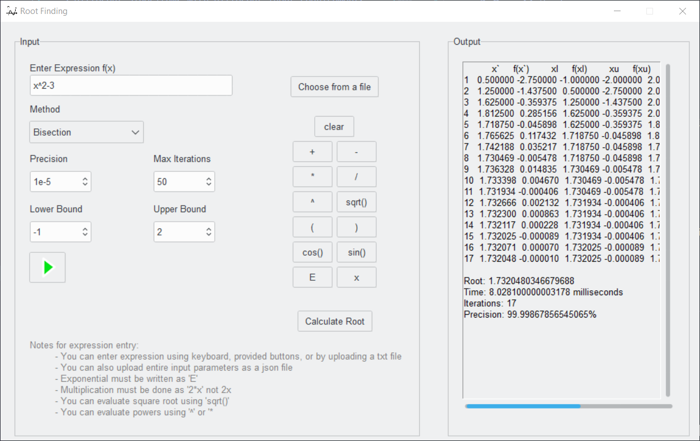
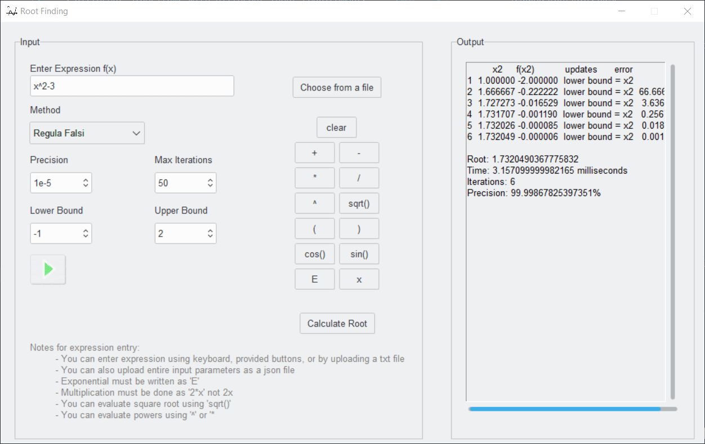
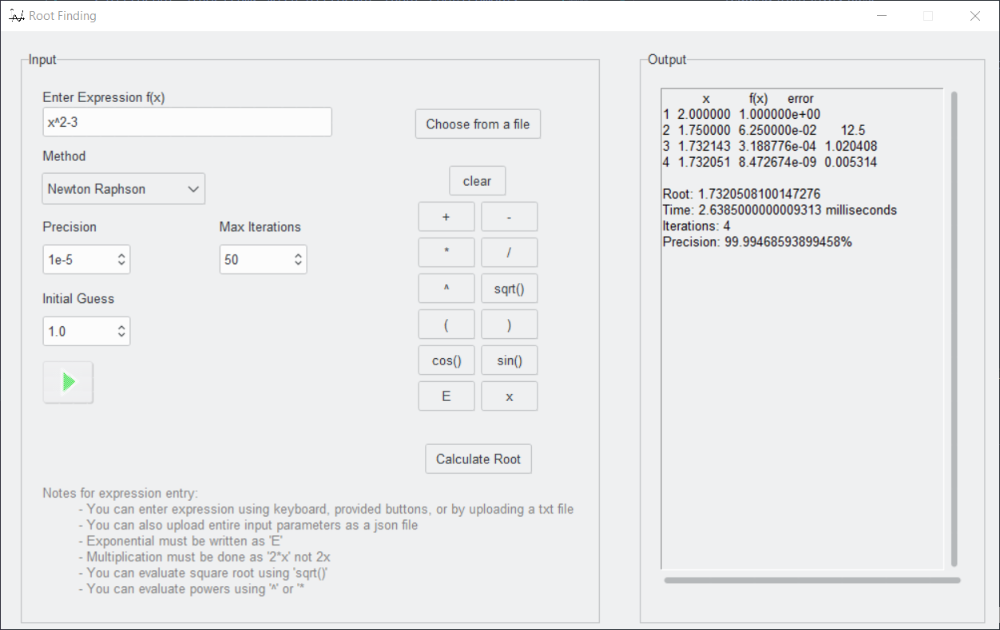
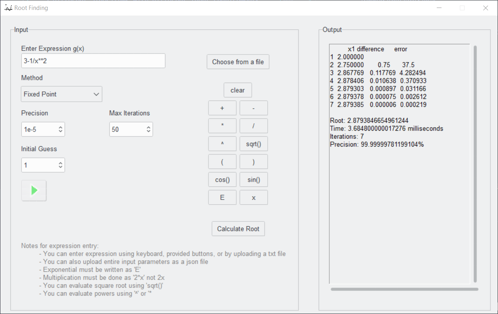
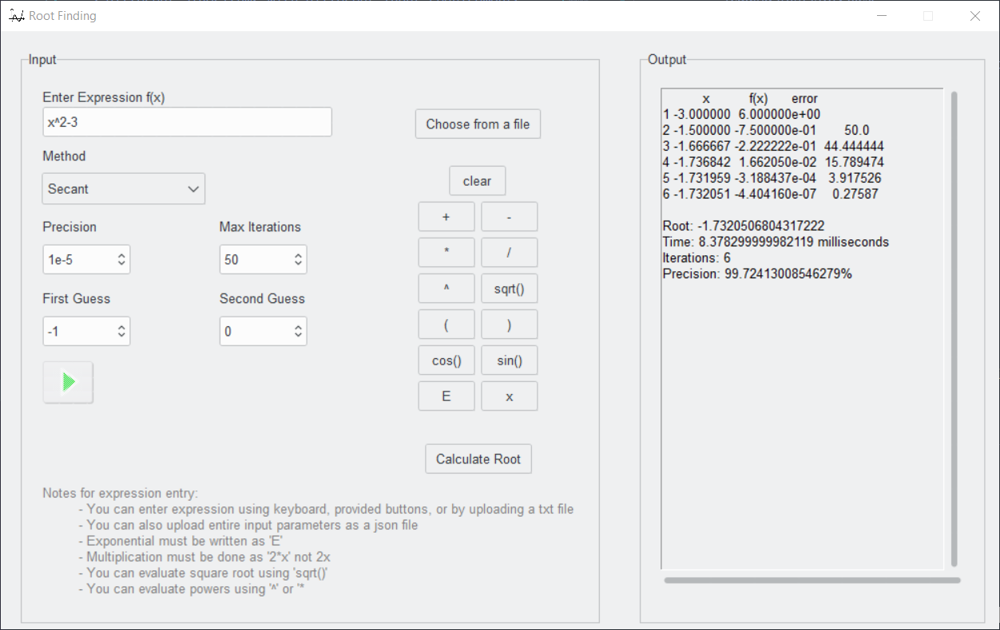

# Root Finding Using Numerical Methods
## Project 1 for Numerical Analysis course
This project aims to implement 5 root finding methods used in many applications espacially with AI and Machine Learning.

## Features
- Wide variety of supported expressions.
- 5 different algorithms with different input requirements.
- reading from JSON files.
- Outputting to JSON files.
- Highly user friendly GUI.
- Graphic visualization of the solutions of *bisection* method.
- organized output in tables.

### A. Bracketing Methods:
1. Bisection Method
2. Regula-Falsi Method
### B. Open Methods:
1. Fixed Point Method 
2. Newton-Raphson Method
3. Secant Method

## Screenshots and sample runs:
    1. Bisection Method
   
   
    2. Regula Falsi
   
   
    3. Newton Raphson
   
    
    4. Fixed Point
   
    
    5. Secant
   

### How to run the program
1. install the following python libraries using `pip3 install library_name`:
    - `tkinter`, 
    - `sympy`, 
    - `pandas`, 
    - `pillow`, 
    - `ttkthemes`.
2. navigate to the project folder
3. run the following command: `py root_finding.py`
- To simulate the solution of bisection method: press the play button.

### Contributors
- Fatema Moharam ID.6655
- Nourhan Waleed ID.6609
- Heba Elwazzan ID.6521
